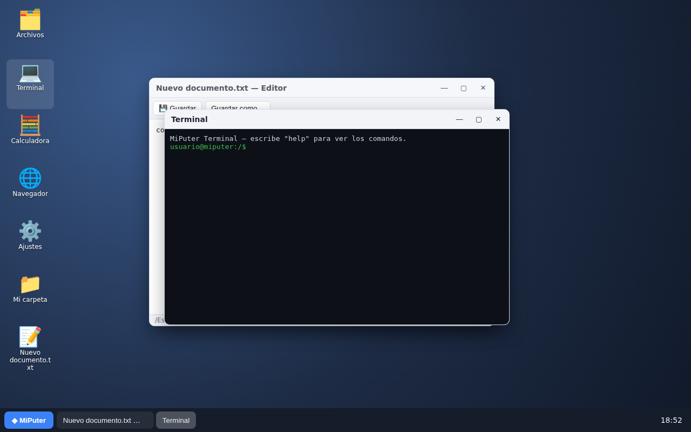

# MiPuter

Mi propio "puter.com": un escritorio completo que se ejecuta en el navegador, hecho con HTML, CSS y JavaScript puros (sin dependencias ni paso de compilación).



## Funciones

- **Escritorio** con iconos, menú contextual (clic derecho), arrastrar y soltar, y barra de tareas con reloj.
- **Gestor de ventanas**: mover, redimensionar, minimizar, maximizar (doble clic en la barra de título) y enfocar.
- **Sistema de archivos virtual** persistente en `localStorage` (carpetas, archivos, renombrar, duplicar, eliminar, mover).
- Subida de archivos desde tu ordenador (botón ⤒ o arrastrándolos al escritorio o al explorador) y descarga.
- **Archivos subidos guardados en Backblaze B2** (llevan una nube ☁ en el icono). Se pueden abrir, editar, duplicar, descargar y borrar; los cambios se aplican también en B2.

### Aplicaciones

| App | Descripción |
| --- | --- |
| 🗂️ Archivos | Explorador con navegación, ruta editable, historial y arrastrar a carpetas |
| 📝 Editor de texto | Abre/guarda `.txt`, `.md`, `.js`… (`Ctrl+S`), avisa de cambios sin guardar |
| 💻 Terminal | `ls`, `cd`, `cat`, `echo > archivo`, `mkdir`, `rm`, `mv`, `cp`, `open`, `neofetch`… |
| 🧮 Calculadora | Con paréntesis y soporte de teclado (sin `eval`) |
| 🌐 Navegador | Navega URLs en un iframe o muestra archivos `.html` del sistema virtual |
| 🖼️ Visor de imágenes | Abre imágenes subidas |
| ⚙️ Ajustes | Fondos de escritorio, tema claro/oscuro y restablecer archivos |

## Cómo ejecutarlo

Necesitas Node.js 20.12 o superior (no hay dependencias que instalar).

```bash
cp .env.example .env   # y rellénalo con tu contraseña y tus datos de B2
npm start
# abre http://localhost:8000
```

### Contraseña

Define `MIPUTER_PASSWORD` en `.env` y MiPuter pedirá esa contraseña antes de mostrar nada (la web, los archivos y la API quedan protegidos). La sesión dura 30 días (`SESSION_DAYS`), y se cierra desde **Inicio → Cerrar sesión**. Al cambiar la contraseña se cierran todas las sesiones abiertas. Tras 5 intentos fallidos seguidos, esa IP queda bloqueada 15 minutos.

Si lo publicas en internet, sírvelo siempre con **HTTPS**, porque si no la contraseña viaja sin cifrar. Detrás de un proxy (nginx, Caddy…) añade `TRUST_PROXY=true` para que el límite de intentos use la IP real.

### Configurar Backblaze B2

1. En el panel de Backblaze, crea un **bucket privado** (Buckets → Create a Bucket).
2. Copia su **Endpoint** (por ejemplo `s3.us-west-004.backblazeb2.com`).
3. En **Application Keys → Add a New Application Key**, crea una clave con acceso de lectura y escritura **solo a ese bucket**. Guarda el `keyID` y la `applicationKey` (esta última solo se muestra una vez).
4. Pon los cuatro valores en `.env`:

   ```env
   B2_KEY_ID=...
   B2_APPLICATION_KEY=...
   B2_BUCKET=nombre-de-tu-bucket
   B2_ENDPOINT=https://s3.us-west-004.backblazeb2.com
   ```

5. Arranca con `npm start`. En la consola debe aparecer `Subidas → Backblaze B2 (bucket "…")`. En la Terminal de MiPuter, el comando `b2` también te dice dónde se guardan las subidas.

**Cómo funciona:** el navegador nunca ve tus claves. Las subidas van a `server.js`, que las firma (AWS Signature V4, la API compatible con S3 de B2) y las guarda en el bucket bajo `miputer/<id>-<nombre>`. Al abrir un archivo, el servidor lo lee de B2 y se lo pasa al navegador, así que no hace falta configurar CORS en el bucket. El árbol de carpetas sigue guardándose en el navegador (`localStorage`) y apunta a esos objetos.

> ⚠️ Si no defines `MIPUTER_PASSWORD`, cualquiera que pueda abrir la dirección del servidor puede leer y borrar los archivos subidos.

### Sin B2

Si `.env` no está configurado (o sirves la carpeta con un servidor estático, como `python3 -m http.server`), todo sigue funcionando y las subidas se guardan en el navegador como antes.

## Estructura

```
server.js         servidor Node: inicio de sesión, web estática y API de archivos en B2
.env.example      plantilla de configuración de B2
index.html
css/style.css
js/
  main.js         arranque: escritorio, menú inicio, reloj
  wm.js           gestor de ventanas y barra de tareas
  fs.js           sistema de archivos virtual (localStorage)
  registry.js     registro de apps y asociación por extensión
  fileActions.js  acciones de archivos compartidas (crear, renombrar, mover…)
  storage.js      cliente de la API de archivos en B2
  ui.js           diálogos, avisos y menú contextual
  apps/           una app por archivo
```

### Añadir una app

Crea `js/apps/miapp.js`:

```js
import { createWindow } from '../wm.js';

export default {
  id: 'miapp',
  name: 'Mi app',
  glyph: '✨',
  extensions: ['xyz'], // opcional: abre estos archivos
  launch({ path } = {}) {
    const win = createWindow({ title: 'Mi app', width: 400, height: 300 });
    win.body.innerHTML = '<p style="padding:16px">¡Hola!</p>';
    return win;
  },
};
```

y regístrala en `js/main.js` añadiéndola a la lista de `register`.
